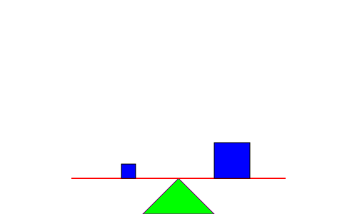
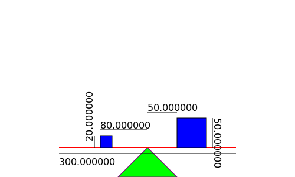

# HOMEWORK
## Device
The device I want to create is a 2D Lever with two square objects. 
**The parameters are:**
1.  The length of the shaft (or rod)
2.  The side's size of the two square objects
3.  The position of the two square objects from the middle of the shaft

For now the dimensions and the position of the triangle that supports the shaft are already given (are fixed).

**How to run**
To run this program you have to download the zip file, run a terminal in the path and type the following steps on the terminal:
1. cd build
2. cmake ..
3. make
4. cd ..
5. cd bin
6. ./main

**With this program you can choose if:**
1. Keep the default sizes. After cheking sizes, the program will create a svg file which will be saved in the ../bin folder. It will also print some Debug strings on the terminal  
2. Change default sizes and create your own lever. The program will check if the sizes in input are correct and then will create an svg file that will be saved in the ../bin folder. It will also print some Debug strings on the terminal  
3. Read sizes from an already existing file that have do be in ../bin folder. The program will search the sizes of the object and store them.

### Documentation of the device updated with version v3.0.0:

**struct Pol_shaft**
~~~ C++
/**
 *  Initialize the shaft
 *  @param s_length : Length of the shaft
*/
struct Pol_shaft{
    float s_length;
};
~~~

**struct Pol_squares**
~~~ C++
/**
 *  Initialize the squares
 *  @param sq1_side: Side of the first square 
 *  @param sq1_pos: Position of the first square object from the center of the shaft
 *  @param sq2_side: Side of the second square 
 *  @param sq2_pos: Position of the second square object from the center of the shaft
*/
struct Pol_squares{
    float sq1_side;
    float sq1_pos;
    float sq2_side;
    float sq2_pos;
};
~~~ 

**Pol_shaft * shaft_init()**
~~~ C++
/**
 * Function that initialize the shaft
 * @param sLength  
*/
Pol_shaft * shaft_init(float sLength);
~~~ 

**Pol_squares * squares_init()**
~~~ C++
/**
 *  Function that initialize the squares
 *  @param side1: Side of the first square 
 *  @param pos1: Position of the first square object from the center of the shaft
 *  @param side2: Side of the second square 
 *  @param pos2: Position of the second square object from the center of the shaft
*/
Pol_squares * squares_init(float side1, float pos1, float side2, float pos2);
~~~
**bool with_measures()**
~~~ C++
/** Function that is used to decide if adding measures to the svg file
 * @return @c bool 1 if the user want an svg WITH measures,
 * 0 if the user want an svg file WITHOUT measures
*/
bool with_measures();
~~~ 

**string to_svg_Machine()**
~~~ C++
/** Function that create a string svg containing the image of the shaft and of the squares
 * 
 *  @param myshaft stucture containg the data of the shaft
 *  @param mysquares stucture containg the data of the squares
 */
string to_svg_Machine(Pol_shaft* myshaft, Pol_squares * mysquares);
~~~ 

**int my_set()**
~~~ C++
/** Function to change sizes and checks constrains
 *  @param ShaftLength Length of the shaft
 *  @param SquareSide1 Side of the square 1
 *  @param SquarePos1 Position of the square 1
 *  @param SquareSide2 Side of the square 2
 *  @param SquarePos2 Position of the square 2
 *  @return @c 1 if every size is ok
 *  @return @c 0 if a size is NOT ok
 * 
*/
int my_set(double ShaftLength, double SquareSide1, double SquarePos1, double SquareSide2, double SquarePos2);
~~~ 

**void svg_to_file()**
~~~ C++
/** Function that print the string "svg" into a file
 *  Receive in input the name of the file's name that I want to create and open and then I print into it the string received
 *  @param filename name of the file 
 *  @param str_svg string containing everything needed to create an svg file
 */
void svg_to_file(string filename, string str_svg);
~~~ 

**string read_svg ()**
~~~ C++
/** Function that read an svg file
 * @param filename name of the file to read
 * @return a string of the file read
*/
string read_svg (string filename);
~~~

**float Finder()**
~~~ C++
/** Function that find element in a string like the svg file 
 * @param str Strig passed, string where the function search elements
 * @param start String from which the function start to store the element
 * @param end  String used by the function to end to store the element
 * @param typeofelement String used to optimize the search, is a svg comment, in case there are multiple similar objects
 * @return @c elementFound a double variable, the element found
*/
float Finder(string str, string start, string end, string typeofelement);
~~~

**Pol_shaft * my_parse_shaft()**
~~~ C++
/**
 * Function that search variables from an svg file and store them
 * This function uses Finder() function
 * @param str String passed, the svg file
 * @return @c newshaftreaded a struct of a new shaft where the parameters are the one readed from str
*/
Pol_shaft * my_parse_shaft(string str);
~~~

**Pol_squares * my_parse_squares()**
~~~ C++
/**
 * Function that search variables from an svg file and store them
 * This function uses Finder() function
 * @param str String passed, the svg file
 * @return @c newsquaresreaded a struct of new squares where the parameters are the one readed from str
*/
Pol_squares * my_parse_squares(string str);
~~~

**void destroyer()**
~~~ C++
/**
 * Function that deallocate instances
*/
void destroyer(Pol_shaft * myshaft, Pol_squares * mysquares);
~~~